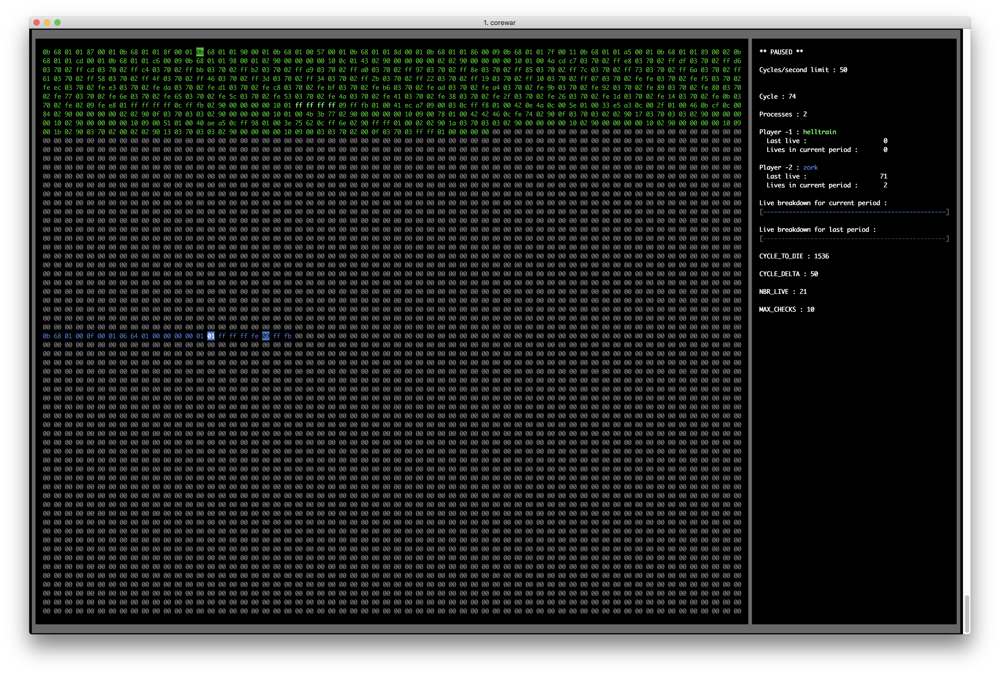

# Corewar Cookbook

### 1. [Введение](Введение)

### 2. [Предоставленные файлы](Предоставленные-файлы)

### 3. [Ассемблер](Ассемблер)

### 4. [Лексический анализ](Лексический-анализ)

### 5. [Из ассемблера в байт-код](Из-ассемблера-в-байт-код)

### 6. [Дизассемблирование](Дизассемблирование)

### 7. [Виртуальная машина](Виртуальная-машина)

### 8. [Визуализация](Визуализация)

# Короткий экскурс в историю

В 1984 году в журнале «Scientific American» появилась статья Andrew Dewdney с описанием игры **«Core Wars»**. Статья начиналась следующими словами:

> Две программы в своей естественной среде обитания — компьютерной памяти — гоняются друг за другом от адреса к адресу. Иногда они выслеживают врага; иногда закладывают батареи цифровых бомб; иногда они копируют сами себя в другое место памяти, чтобы избежать опасности или останавливаются, чтобы поправить нанесенный противником ущерб. Эту игру я называю «Core Wars»…

Источник: [Глава 2. Часть 1. Сражение на «ферромагнитных сердечниках» или MARS — бог войны.](https://www.useless.school/single-post/2017/06/01/Глава-2-Сражение-на-«ферромагнитных-сердечниках»-или-MARS---бог-войны-Часть-1)

# Обзор проекта «Corewar»

Именно на основе этой довольно популярной в узких кругах игры построен проект **«Corewar»**, который состоит из трех обязательных частей:

* Чемпион (The Champion)
* Ассемблер (The Assembler)
* Виртуальная машина (The Virtual Machine)

## Чемпион

Суть данного раздела заключается в написании кода на языке ассемблера, который затем будет помещен в файл с расширением `.s`.

> На самом деле мы пишем код на языке псевдоассемблера. То есть на созданном специально для этого задания языке, который похож на настоящий ассемблер, но все же им не является. Но для соответствия тексту задания, простоты и в целях экономии шести букв мы тоже будем называть этот язык ассемблером.

Созданный код это и есть наш чемпион, цель которого — сражаться с другими чемпионами, написанными нами или другими людьми.

Код каждого чемпиона имеет следующую структуру:

1. Имя
2. Комментарий
3. Исполняемый код

Он может выглядеть, например, вот так:

```
.name       "Batman"
.comment    "This city needs me"

loop:
        sti r1, %:live, %1
live:
        live %0
        ld %0, r2
        zjmp %:loop
```

В данном проекте у нас нет цели создать самого сильного и непобедимого чемпиона. Это задача для совершенно другого проекта под названием **«Corewar Championship»**.

В **«Corewar»** мы создаем своего чемпиона только для того, чтобы продемонстрировать понимание темы и умение писать код на ассемблере. А не для того, чтобы он мог кого-то победить.

Наша задача — написать код без ошибок, чтобы программа `asm` смогла превратить его в байт-код, который затем бы выполнила виртуальная машина.

Цели выиграть битву или продемонстрировать хоть сколько-нибудь достойный результат в сражении перед нами не стоит.

## Ассемблер

Задача этого раздела — создание программы, которая будет транслировать написанный на языке ассемблера код чемпиона в байт-код — кучу чисел в шестнадцатеричной системе исчисления.

> С эльфийского это задание можно трактовать как «перевести команды с языка понятного человеку (ассемблера) на язык, понятный виртуальной машине (байт-код)».

> **Трансляция программы** — преобразование программы, представленной на одном из языков программирования, в программу на другом языке. Транслятор обычно выполняет также диагностику ошибок, формирует словари идентификаторов, выдаёт для печати текст программы и т. д.

Источник: [Транслятор — Википедия](https://ru.wikipedia.org/wiki/Транслятор)

То есть мы должны создать программу с именем `asm` (от слова «assembler»), которая будет получать в качестве параметра файл с кодом на языке ассемблера и создавать на его основе новый файл с байт-кодом.

Файл с кодом нашего чемпиона, написанный на ассемблере, должен иметь расширение `.s`. На его основе программа `asm` создаст новый файл с расширением `.cor`, где и будет находиться созданный байт-код.

Имя самого файла останется неизменным. То есть после вызова команды `./asm batman.s` рядом с файлом `batman.s` должен появиться файл `batman.cor`. Конечно же, если во время трансляции не возникнет какой-либо ошибки.

## Виртуальная машина

После того, как мы получили файл с байт-кодом, наступает время работы виртуальной машины.

Виртуальная машина это тоже программа, исполнительный файл которой должен называться `corewar`.

Её задача — выделить определенный участок памяти, разместить на этом участке код чемпионов и каретки, которые будут его исполнять.

А затем следить за ходом битвы, чтобы объявить чемпиона-победителя после её завершения.

## Бонусы

Как всегда количество бонусов и их суть ограничивается исключительно фантазией автора.

Вот несколько из тех, которые можно было бы реализовать:

### Расширенные сообщение об ошибках

Если во время генерации байт-кода произошла ошибка, то желательно, чтобы в этом случае программа `asm` повела себя как настоящий транслятор, которым она на самом деле и является. То есть вывела осмысленное сообщение — в какой строке при работе с файлом `.s` произошла ошибка и какой ее тип.

### Возможность дизассемблировать байт-код

Сделать возможным получение исходного кода на ассемблере имея в распоряжении файл с байт-кодом. То есть реализовать функцию обратную той, для которой предназначена программа `asm`.

### Визуализатор

Создать программу, которая будет отображать состояние памяти, а также изменение ключевых игровых параметров во время сражения.

К этому также можно добавить различные звуковые эффекты, чтобы акцентировать внимание на таких ключевых моментах, как смерть каретки или объявление победителя.

# Полезные ссылки

На сайте «University of Useless Knowledge» есть серия из трех статей, которая описывает идеи и принципы игры «Core Wars». Также в этих статьях есть примеры кода чемпионов и разбор того, как этот самый код может сражаться и наносить ущерб. Правда все это на языке настоящего ассемблера.

Но в целом это неплохое введение в тему, которое подробно рассказывает, в чем заключается суть «битвы в памяти»:

* [Глава 2. Часть 1. Сражение на «ферромагнитных сердечниках» или MARS — бог войны.](https://www.useless.school/single-post/2017/06/01/Глава-2-Сражение-на-«ферромагнитных-сердечниках»-или-MARS---бог-войны-Часть-1)

* [Глава 2. Часть 2. Сражение на «ферромагнитных сердечниках» или Проблема близнецов.](https://www.useless.school/single-post/2017/06/05/Глава-2-Часть-2-Сражение-на-«ферромагнитных-сердечниках»-или-Проблема-близнецов)

* [Глава 2. Часть 3. Сражение на «ферромагнитных сердечниках» или Переключение процессов.](https://www.useless.school/single-post/2017/06/09/Глава-2-Часть-3-Сражение-на-«ферромагнитных-сердечниках»-или-Переключение-процессов)

На странице проекта «Corewar» приведены ссылки для скачивания следующих файлов:

# Архив `vm_champs.tar`

В этом архиве можно найти скомпилированный исполняемый файл виртуальной машины `corewar`, скомпилированную программу-транслятор `asm`, а также множество чемпионов в виде `.s` и `.cor` файлов.

## Транслятор `asm`

В задании проекта сказано, что программа `asm` переводит код из языка ассемблера, записанного в `.s` файле, в байт-код, который должен быть помещен в файл с расширением `.cor`.

Но на самом деле предоставленная программа не обращает никакого внимания на расширения входящих файлов. Она лишь ищет последнюю точку в имени и заменяет всё дальнейшее его содержимое расширением `.cor`.

Вопрос «Насколько можно назвать такой подход оптимальным?» остается открытым.

Ведь это делает возможными следующие ситуации, которые хоть и не являются ошибками в привычном понимании, но все же нарушают заявленный workflow:

```
$ ./asm batman.cor
Writing output program to batman.cor
```

```
$ ./asm batman
Writing output program to .cor
```

```
$ ./asm dc.heroes/batman
Writing output program to dc.cor
```

Также предоставленная программа никак не ограничивает количество принимаемых на обработку чемпионов.

Поэтому за один раз в качестве аргументов можно указать множество файлов с самыми разными расширениями. Правда, обработан будет только последний из них:

```
$ ./asm ant-man.s iron_man.s batman.s
Writing output program to batman.cor
```

Все остальные аргументы `asm` игнорирует:

```
$ ./asm --undefined-flag incorrect_file.s batman.s
Writing output program to batman.cor
```

### Как с этим жить?

Поскольку в тексте задания подобное поведение не описано, в собственной реализации можно ограничить количество принимаемых аргументов всего одним файлом, который гарантировано должен иметь расширение `.s`.

Это сделает работу `asm` более прозрачной и ликвидирует приведенные выше уязвимости в workflow.

> Кстати, виртуальная машина также не проверяет входящие файлы на наличие расширения `.cor`.
> 
> И хотя для программы `corewar` такое поведение не является источником уязвимостей, в своей реализации данную проверку всё же стоит добавить для соблюдения единого стиля поведения всех компонентов системы.

## Чемпионы

Также имеются проблемы с предоставленными примерами чемпионов.

К сожалению, не все файлы были написаны корректно. Поэтому часть из них программа `asm` не сможет транслировать в байт-код и выдаст ошибку.

### Как с этим жить?

В такой ситуации стоит учитывать, что с файлами из папки `champs/examples` проблем не возникнет, а вот в работоспособности остальных предстоит убедиться лично.

# Файлы `op.c` и `op.h`

В файле `op.c` находиться структура, которая описывает каждую операцию, определенную в языке ассемблера.

Приведенные в этой структуре данные мы можем перезаписать в любой удобной для нас форме и поместить в проект. Никаких ограничений в данном случае не установлено.

Также нам предоставляется заголовочный файл `op.h`. В нем содержатся важные константы препроцессора, которые определяют параметры работы виртуальной машины, а также синтаксис ассемблера.

С этим файлом стоит обращаться более бережно и включить в проект таким, какой он есть. Внеся лишь самые необходимые изменения.

Поскольку для участия в проекте **«Corewar Championship»** его наличие является одним из условий:

>  It will be executed on our own virtual machine, so the configuration will be the one you will describe in your file `op.h` that will be attached.

Необходимыми изменениями, которые обязательно нужно выполнить над данным файлом, является его приведение в соответствие с Norm'ой. Поскольку предоставленный файл не соответствует установленным правилам форматирования и Norminette при его проверке выдаст ряд предупреждений о найденных ошибках.

Если же участие в соревновании «Corewar Championship» не запланировано, то о судьбе файла `op.h` беспокоиться не стоит. В данном случае с ним можно проводить любые, даже гораздо более серьезные изменения, чем простое приведение к Norm'е.

# Синтаксис ассемблера

Язык ассемблера подчиняется правилу «В одной строке — одна инструкция».

> Инструкция или оператор (англ. statement) — наименьшая автономная часть языка программирования; команда или набор команд. Программа обычно представляет собой последовательность инструкций.

Источник: [Оператор (программирование) — Википедия](https://ru.wikipedia.org/wiki/Оператор_(программирование))

Пустые строки, комментарии, как и лишние tab'ы или пробелы, игнорируются.

## Комментарий

В header'е `op.h` есть константа `COMMENT_CHAR`. Она определяет какой символ, обозначает начало комментария.

В предоставленном файле это октоторп — `#`.

То есть в качестве комментария будет восприниматься всё между символом `#` и концом строки.

Комментарий может располагаться в любой части файла.

Пример #1:

```
# UNIT Factory
# is a programming school
```

Пример #2:

```
ld %0, r2    # And it is located in UNIT City
```

## Альтернативный комментарий

В предоставленном архиве `vm_champs.tar` по пути `champs/examples` можно найти файл `bee_gees.s` с кодом чемпиона, который оригинальная программа `asm` транслирует в байт-код без ошибок.

В коде этого чемпиона встречаются два вида комментариев:

* стандартный, который был рассмотрен выше;
* альтернативный, о котором нет информации в subject'e.

Этот альтернативный вид от стандартного и описанного в subject'е отличается лишь символом начала комментария. Вместо октоторпа (`#`) здесь выступает `;`.

Пример использования комментария данного вида:

```
sti r1, %:live, %1    ; UNIT City is placed in Kyiv, Ukraine
```

### Как с этим жить?

Этот вид комментария не описывается в subject'е, но поддерживается оригинальным транслятором. Поэтому мы, скорее всего, не обязаны его обрабатывать.

Но все же добавим его поддержку в наш проект. Для этого в заголовочный файл `op.h` будет внесена следующая строчка:

```
# define ALT_COMMENT_CHAR    ';'
```

> Это будет вторым (первое — приведение к Norm'е) и последним изменением, которое мы внесем в файл `op.h`.

## Имя чемпиона

В файле с кодом чемпиона должно быть определено его имя. Для этого в ассемблере существует команда, имя которой определено в константе `NAME_CMD_STRING`. В предоставленном файле `op.h` это `.name`.

То есть после команды `.name` должна следовать строка с именем нашего чемпиона:

```
.name    "Batman"
```

Длина строки не должна превышать число заданное в константе `PROG_NAME_LENGTH`. В предоставленном файле оно равно `128`.

Кстати, в качестве имени чемпиона также может выступать пустая строка:

```
.name    ""
```

Но полное отсутствие строки это уже ошибка:

```
.name    
```

## Комментарий чемпиона

Также в файле с расширением `.s` должен быть определен комментарий чемпиона.

Команда, которая поможет это сделать, содержится в константе `COMMENT_CMD_STRING` файла `op.h`. В предоставленном файле это `.comment`.

Длина строки-комментария ограничена константой `COMMENT_LENGTH`. В предоставленном файле `op.h` её значение равно `2048`.

По своей сути команда `.comment` очень похожа на `.name` и ведет себя аналогичным образом в случаях с пустой строкой и в случаях с её полным отсутствием.

## Другие команды

В некоторых файлах с расширением `.s`, которые были предоставлены нам в качестве примера, встречалась такая команда как `.extend`.

Эта команда, как и любые другие отличные от `.name` и `.comment`, не описана в subject'e и оригинальным транслятором определяется как ошибочная.

Таким же образом с подобными командами будем обращаться и мы.

## Исполняемый код

Исполняемый код чемпиона состоит из инструкций.

Для языка ассемблера действует правило «Одна строка — одна инструкция». И символом окончания инструкции в этом языке является перевод строки. То есть вместо привычного в языке С символа `;` здесь выступает символ `\n`.

Опираясь на это правило мы должны помнить, что **даже после последней инструкции должен следовать перевод строки**. Иначе, `asm` выведет сообщение об ошибке.

Каждая инструкция состоит из нескольких компонентов:

### Метка

Метка состоит из символов, которые были определены в константе `LABEL_CHARS`. В файле-примере это `abcdefghijklmnopqrstuvwxyz_0123456789`.

То есть в составе метки не могут присутствовать символы, которые не указаны в `LABEL_CHARS`.

А за самой меткой должен следовать символ определенный в константе `LABEL_CHAR`. В файле-примере это символ `:`.

#### Зачем нужны метки?

Метка указывает на операцию, которая следует прямо за ней. Именно на одну операцию, а не на их блок.

```
.name       "Batman"
.comment    "This city needs me"

loop:
        sti r1, %:live, %1    # <-- На эту операцию указывает метка loop
live:
        live %0               # <-- На эту операцию указывает метка live
        ld %0, r2             # <-- А на эту операцию никакая метка не указывает
        zjmp %:loop
```

Задача меток состоит в том, чтобы упростить нашу жизнь, а точнее процесс написания кода.

Чтобы в полной мере осознать их роль, давайте представим мир без меток.

Как мы знаем, написанный на языке ассемблера код чемпиона после работы программы-транслятора превратится в множество байтов, представленных в шестнадцатеричной системе исчисления. И именно такой байт-код будет выполнять виртуальная машина.

Допустим, нам нужно организовать цикл, в котором бы раз за разом выполнялась операция `live`. Для этого у нас есть операция `zjmp`, которая может перебросить нас на N-ое количество байтов вперед или назад.

В рассматриваемом случае нам нужно после каждой итерации цикла снова возвращаться на операцию `live`. Вот только сколько это байтов назад? Чтобы это выяснить нужно узнать сколько байтов в байт-коде займет код операции и её аргумент.

Как мы узнаем позже, код операции `live` занимает 1 байт, а её единственному аргументу необходимо 4 байта.

Получается нам нужно вернуться на 5 байтов назад:

```
live %1
zjmp %-5
```

Не так уж сложно, но все же подобные расчеты занимают время. И гораздо проще было бы просто написать «перейти на операцию `live`». Для этого и существуют метки.

Мы просто создаем метку на нужную нам операцию `live` и передаем её операции `zjmp`:

```
loop:    live %1
         zjmp %:loop
```

С точки зрения трансляции кода на ассемблере в байт-код оба примера абсолютно идентичны. Во время работы программа `asm` высчитает на сколько байтов назад указывает метка `loop` и подменит её на число `-5`.

Так, что для итогового результата совершенно не важно, что было использовано. Вот только писать код с использованием меток гораздо удобнее.

#### Формы записи

Для записи метки существует несколько подходов:

```
marker:
        live %0
```

```
marker:


        live %0
```

```
marker: live %0
```

Все приведенные выше примеры для программы-транслятора означают одно и тоже.

Поэтому можно выбрать любой из представленных вариантов.

#### Много меток для одной операции

Также возможна такая форма записи:

```
marker:

label:
        live %0
```

Это означает, что и метка `marker`, и метка `label` указывают на одну и ту же операцию.

#### Без операции

А может сложиться ситуация, когда у метки нет операции, на которую она могла бы указывать:

```
marker: 
# Конец файла
```

В таком случае метка указывает на место, сразу за исполняемым кодом чемпиона.

Главное, чтобы в конце линии, на которой она расположена, находился `\n`. Иначе транслятор сообщит об ошибке.

### Операции и их аргументы

Язык ассемблера имеет определенный набор из 16 операций. Каждая из которых принимает от одного до трех аргументов.

Информация об имени операции, её коде, а также об аргументах, которые она принимает, приведена в предоставленном заданием файле `op.c`.

Код операции|Имя операции|Аргумент #1|Аргумент #2|Аргумент #3
:-----:|:-----:|:-----:|:-----:|:-----:	
1|`live`|`T_DIR`|—|—
2|`ld`|`T_DIR` / `T_IND`|`T_REG`|—
3|`st`|`T_REG`|`T_REG` / `T_IND`|—
4|`add`|`T_REG`|`T_REG`|`T_REG`
5|`sub`|`T_REG`|`T_REG`|`T_REG`
6|`and`|`T_REG` / `T_DIR` / `T_IND`|`T_REG` / `T_DIR` / `T_IND`|`T_REG`
7|`or`|`T_REG` / `T_DIR` / `T_IND`|`T_REG` / `T_DIR` / `T_IND`|`T_REG`
8|`xor`|`T_REG` / `T_DIR` / `T_IND`|`T_REG` / `T_DIR` / `T_IND`|`T_REG`
9|`zjmp`|`T_DIR`|—|—
10|`ldi`|`T_REG` / `T_DIR` / `T_IND`|`T_REG` / `T_DIR`|`T_REG`
11|`sti`|`T_REG`|`T_REG` / `T_DIR` / `T_IND`|`T_REG` / `T_DIR`
12|`fork`|`T_DIR`|—|—
13|`lld`|`T_DIR` / `T_IND`|`T_REG`|—
14|`lldi`|`T_REG` / `T_DIR` / `T_IND`|`T_REG` / `T_DIR`|`T_REG`
15|`lfork`|`T_DIR`|—|—
16|`aff`|`T_REG`|—|—

Разобраться какова роль каждой операции и как она интерпретирует аргументы разных типов это самая важная задача для понимания основ проекта «Corewar».

# Операции и их аргументы

## Аргументы

Каждый аргумент соответствует одному из трех типов:

### 1. Регистр — Registry — `T_REG`

Регистр это такая переменная, где мы можем хранить какие-либо данные. Размер этой переменной в октетах обозначен в константе `REG_SIZE`, которая в файле-примере `op.h` инициализирована значением `4`.

> Октет в информатике — восемь двоичных разрядов. В русском языке октет обычно называют байтом.

Источник: [Октет (информатика) — Википедия](https://ru.wikipedia.org/wiki/Октет_(информатика))

Количество регистров ограничено числом указанным в константе `REG_NUMBER`. В примере — `16`.

То есть доступные нам регистры это `r1`, `r2`, `r3` ... `r16`.

> **Значения регистров**
>
> Во время запуска виртуальной машины все регистры, кроме `r1`, будут инициализированы нулями.
>
> В `r1` будет записан номер игрока-чемпиона. Только со знаком минус.
> 
> Данный номер уникален в рамках игры и нужен операции `live`, чтобы сообщить, что конкретный игрок жив.
>
> То есть каретка, которая будет размещена на начале кода игрока под номером `2`, получит значение `r1` равным `-2`.
>
> В случае, если операция `live` будет выполнена с аргументом `-2`, виртуальная машина засчитает, что данный игрок жив:
>
> ```
> live %-2
> ```

### 2. Прямой — Direct — `T_DIR`

Прямой аргумент состоит из двух частей: символ, который задан в константе `DIRECT_CHAR` (`%`) + число или метка, которые представляют **прямое значение**.

В случае, если речь идет о метке, то перед её именем также должен быть указан символ из переменной `LABEL_CHAR` (`:`):

```
sti r1, %:marker, %1
```

> **Что такое прямое и непрямое значение?**
>
> Чтобы осознать разницу между прямым и непрямым значением, стоит рассмотреть один очень простой пример.
>
> Представим, что у нас есть число `5`. В своем прямом значении оно представляет самого себя. То есть число `5` это число `5`.
>
> Но в непрямом значении это уже не число, а относительный адрес, который указывает на 5 байтов вперед.

> **Метка в прямом и непрямом значении**
>
> Если с числами в прямом и непрямом значении все понятно, то как быть с метками? В чем тут разница?
>
> Все довольно просто. Как мы знаем, данные операции будет выполнять виртуальная машина. И именно для нее важно какой аргумент был получен. Прямой или непрямой?
> 
> Вот только до виртуальной машины метки попросту не дойдут. На этапе трансляции в байт-код они все будут заменены на свои числовые эквиваленты.
> 
> Поэтому метки это те же числа. Только записанные в другой форме
> 
> Процесс замены меток на числа описан в главе «Зачем нужны метки?».

### 3. Непрямой — Indirect — `T_IND`

Аргументом данного типа может быть либо число, либо метка, которые представляют **непрямое значение**.

Если в качестве аргумента типа `T_IND` выступает число, то никаких дополнительных символов не нужно:

```
ld    5, r7
```

Если таким аргументом является метка, то перед её именем должен быть указан символ из переменной `LABEL_CHAR` (`:`):

```
ld    :label, r7
```

## Символ-разделитель

Для того, чтобы отделить один аргумент от другого в рамках одной операции, в ассемблере используется специальный символ-разделитель. Он определяется константой препроцессора `SEPARATOR_CHAR` и в файле-примере `op.h` это символ `,`:

```
ld    21, r7
```

## Операции

### Операция `live`

Код операции|Имя операции|Аргумент #1|Аргумент #2|Аргумент #3
:-----:|:-----:|:-----:|:-----:|:-----:
1|`live`|`T_DIR`|—|—

**Описание**

На операцию `live` возложены две функции:

1. Она засчитывает, что **каретка**, которая выполняет операцию `live`, жива.

2. Если указанный в качестве аргумента операции `live` номер совпадает с номером игрока, то она засчитывает, что это игрок жив. Например, если значение аргумента равно `-2`, значит игрок с номером `2` жив.

> **Что такое каретка?**
>
> Подробное объяснение этого термина будет дано в [разделе «Виртуальная машина»](Виртуальная-машина), поскольку каретка относится именно к этой части проекта «Corewar».
>
> Но поскольку базовые знания об этом термине являются необходимым условием для понимания работы операций, коротко рассмотрим, что же это такое.
>
> Каретка это процесс, выполняющий операцию, на которой стоит.
>
> Допустим мы запускаем виртуальную машину с тремя игроками-чемпионами, которым предстоит сражаться за победу.
>
> Значит, в памяти виртуальной машины будут размещены исполняемые коды чемпионов. И на начало каждого из участков памяти будет помещена каретка.
>
> 3 чемпиона. 3 участка памяти с размещенными на них исполняемыми кодами. 3 каретки.
>
> Каждая каретка содержит в себе несколько важных элементов:
>
> * `PC` (Program Counter)
>
> Переменная, которая содержит позицию каретки.
>
> * Регистры
>
> Те самые регистры, количество которых определяет константа `REG_NUMBER`.
>
> * Флаг `carry`
>
> Специальная переменная, которая влияет на работу функции `zjmp` и может принимать одно из двух значений: `1` или `0` (`true` или `false`).
>
> * Номер цикла, в котором данной кареткой в последний раз выполнялась операция `live`
>
> Эта информация нужна, чтобы определить жива ли каретка.
>
> На самом деле каретка содержит в себе гораздо больше элементов, но они будут рассмотрены позже.

### Операция `ld`

Код операции|Имя операции|Аргумент #1|Аргумент #2|Аргумент #3
:-----:|:-----:|:-----:|:-----:|:-----:
2|`ld`|`T_DIR` / `T_IND`|`T_REG`|—

**Описание**

Задача этой операции состоит в загрузке значения в регистр. Но её поведение отличается в зависимости от типа первого аргумента:

* Аргумент #1 — `T_DIR`

Если тип первого аргумента это `T_DIR`, то число переданное в качестве аргумента будет воспринято «как есть».

Задачи операции:

1. Записать полученное число в регистр, который был передан в качестве второго аргумента.

2. Если в регистр записали число `0`, то установить значение `carry` в `1`. Если было записано не нулевое значение, то установить `carry` в `0`.

* Аргумент #1 — `T_IND`

Если тип первого аргумента это `T_IND`, то в данном случае число представляет собой адрес.

В случае получения аргумента такого типа он обрезается по модулю — `<ПЕРВЫЙ_АРГУМЕНТ> % IDX_MOD`.

> **Что такое `IDX_MOD`?**
>
> `IDX_MOD` это еще одна константа из файла `op.h`. Её значение определяется с помощью выражения `(MEM_SIZE / 8)`, где `MEM_SIZE` определяет объем памяти в байтах. В виртуальной машине на участке памяти размером с `MEM_SIZE` и будут биться чемпионы.
>
> Так для чего же нужна константа `IDX_MOD`? Она нужна для того, чтобы каретка не могла прыгать в памяти на слишком большие расстояния. В файле-примере константа `MEM_SIZE` была инициализирована значением `(4 * 1024)`. Поэтому значение `IDX_MOD` в этом случае соответствует `512`.
>
> Получается, что каретка не сможет за один прыжок переместиться дальше, чем на 512 байт.

После того, как аргумент типа `T_IND` был усечен по модулю, полученное значение используется как относительный адрес — на сколько байтов вперед или назад относительно текущего местоположения каретки находится нужная нам позиция.

Задача операции `ld`:

1. Определить адрес — текущая позиция + `<ПЕРВЫЙ_АРГУМЕНТ> % IDX_MOD`.

2. С полученного адреса необходимо считать **4 байта**.

3. Записать считанное число в регистр, который был передан в качестве второго параметра.

4. Если в регистр записали число `0`, то устанавливаем значение `carry` в `1`. Если было записано не нулевое значение, то устанавливаем `carry` в `0`.

> **Почему мы считываем именно 4 байта?**
>
> Как мы знаем размер каждого регистра составляет 4 байта. А точнее то количество байт, которое определено в файле `op.h` константой `REG_SIZE`.
>
> В том же файле определен размер аргумента типа `T_DIR`:
>
> ```
> # define REG_SIZE    4
> # define DIR_SIZE    REG_SIZE
> ```
> 
> И он тоже составляет 4 байта.
>
> Мы переходим по адресу, который задан с помощью аргумента типа `T_IND`, чтобы считать значение. Считать число «как оно есть». То есть получить число типа `T_DIR`. И это самое число мы должны записать в регистр. Для того, чтобы запись прошла успешно и считанное число поместилось в регистр, размеры этого числа и размеры регистра должны быть совместимы.
> 
> Также во время разбора следующих операций станет известно, что мы можем не только считывать значение и записывать его в регистр, но и проводить обратное действие — выгружать значение из регистра по адресу.
> 
> Поэтому размеры числа и регистра должны быть совместимы в обоих направлениях. В этом случае единственным возможным решением является сделать количество байт, которые мы считываем (или на которое записываем) равным количеству байт, которое мы можем сохранить в регистре.
>
> В общем, мы считываем столько байт, сколько может вместить регистр.

### Операция `st`

Код операции|Имя операции|Аргумент #1|Аргумент #2|Аргумент #3
:-----:|:-----:|:-----:|:-----:|:-----:
3|`st`|`T_REG`|`T_REG` / `T_IND`|—

**Описание**

Эта операция записывает значение из регистра, который был передан как первый параметр. А вот куда данная операция его записывает, зависит от типа второго аргумента:

* Аргумент #2 — `T_REG`

Если второй аргумент соответствует типу `T_REG`, то значение записывается в регистр.

Например, в данном случае значение из регистра номер 7 записывается в регистр с номером 11:

```
st    r7, r11
```

* Аргумент #2 — `T_IND`

Как мы помним аргументы типа `T_IND` это об относительных адресах. Поэтому в данном случае порядок работы операции `st` такой:

1. Усечь значение второго аргумента по модулю `IDX_MOD`.

2. Определить адрес — текущая позиция + `<ВТОРОЙ_АРГУМЕНТ> % IDX_MOD`

3. Записать значение из регистра, который был передан в качестве первого аргумента, в память по полученному адресу.

### Операция `add`

Код операции|Имя операции|Аргумент #1|Аргумент #2|Аргумент #3
:-----:|:-----:|:-----:|:-----:|:-----:
4|`add`|`T_REG`|`T_REG`|`T_REG`

**Описание**

К счастью у данной операции все аргументы имеют один и тот же тип. Поэтому с ней все просто.

Задача операции `add`:

1. Просуммировать значение из регистра, который был передан как первый аргумент, с значением регистра, который был передан как второй аргумент.

2. Записать полученный результат в регистр, который был передан как третий аргумент.

3. Если полученная сумма, которую мы записали в третий аргумент была равна нулю, то устанавливаем `carry` в `1`. А если сумма была не нулевой — в `0`.

### Операция `sub`

Код операции|Имя операции|Аргумент #1|Аргумент #2|Аргумент #3
:-----:|:-----:|:-----:|:-----:|:-----:
5|`sub`|`T_REG`|`T_REG`|`T_REG`

**Описание**

В данной операции также нет неоднозначности относительно аргументов.

Её задачи:

1. От значения регистра, переданного в качестве первого аргумента, отнять значение регистра, который был передан в качестве второго аргумента.

2. Полученный результат записать в регистр, который был передан в качестве третьего аргумента.

3. Если записанный результат был равен нулю, то значение `carry` сделать равным `1`. Если результат был не нулевой, то сделать равным `0`.

### Операция `and`

Код операции|Имя операции|Аргумент #1|Аргумент #2|Аргумент #3
:-----:|:-----:|:-----:|:-----:|:-----:
6|`and`|`T_REG` / `T_DIR` / `T_IND`|`T_REG` / `T_DIR` / `T_IND`|`T_REG`

**Описание**

`and` выполняет операцию «побитовое И» для значений первых двух аргументов и записывает полученный результат в регистр, переданный в качестве третьего аргумента.

Если записанный результат был равен нулю, то значение `carry` нужно установить равным `1`. Если результат был не нулевой, то — равным `0`.

Поскольку первый и второй аргумент могут быть одного из трех типов, мы рассмотрим как получить значение каждого из них:

* Аргумент #1 / Аргумент #2 — `T_REG`

В данном случае значение берется из регистра, переданного в качестве аргумента.

* Аргумент #1 / Аргумент #2 — `T_DIR`

В этом случае используется переданное в качестве аргумента числовое значение.

* Аргумент #1 / Аргумент #2 — `T_IND`

Если тип аргумента `T_IND`, то необходимо установить адрес, с которого будет считано 4 байта.

Адрес определяется следующим образом — текущая позиция + `<АРГУМЕНТ> % IDX_MOD`.

Считанное по этому адресу 4-байтовое число и будет требуемым значением.

### Операция `or`

Код операции|Имя операции|Аргумент #1|Аргумент #2|Аргумент #3
:-----:|:-----:|:-----:|:-----:|:-----:
7|`or`|`T_REG` / `T_DIR` / `T_IND`|`T_REG` / `T_DIR` / `T_IND`|`T_REG`

**Описание**

По своей сути эта операция полностью аналогична операции `and`. Только в данном случае «побитовое И» заменяется на **«побитовое ИЛИ»**.

### Операция `xor`

Код операции|Имя операции|Аргумент #1|Аргумент #2|Аргумент #3
:-----:|:-----:|:-----:|:-----:|:-----:
8|`xor`|`T_REG` / `T_DIR` / `T_IND`|`T_REG` / `T_DIR` / `T_IND`|`T_REG`

**Описание**

По своей сути эта операция полностью аналогична операции `and`. Только в данном случае «побитовое И» заменяется на **«побитовое исключающее ИЛИ»**.

> **Как работает «побитовое исключающее ИЛИ» (XOR) ?**
> 
> A|B|A ^ B
> :-----:|:-----:|:-----:
> 0|0|0
> 0|1|1
> 1|0|1
> 1|1|0

### Операция `zjmp`

Код операции|Имя операции|Аргумент #1|Аргумент #2|Аргумент #3
:-----:|:-----:|:-----:|:-----:|:-----:
9|`zjmp`|`T_DIR`|—|—

**Описание**

Эта та самая функция, на работу которой влияет значение флага `carry`.

Если оно равно `1`, то функция обновляет значение `PC` на адрес — текущая позиция + `<ПЕРВЫЙ_АРГУМЕНТ> % IDX_MOD`.

То есть `zjmp` устанавливает куда должна переместиться каретка для выполнения следующей операции. Это позволяет нам перепрыгивать в памяти на нужную позицию, а не выполнять всё по порядку.

Если значение `carry` равно нулю, перемещение не выполняется.

### Операция `ldi`

Код операции|Имя операции|Аргумент #1|Аргумент #2|Аргумент #3
:-----:|:-----:|:-----:|:-----:|:-----:
10|`ldi`|`T_REG` / `T_DIR` / `T_IND`|`T_REG` / `T_DIR`|`T_REG`

**Описание**

Данная операция записывает значение в регистр, который был ей передан как третий параметр. Значением, которая она записывает, являются 4 байта. Эти 4 байта она считывает по адресу, который формируется по следующему принципу: текущая позиция + `(<ЗНАЧЕНИЕ_ПЕРВОГО_АРГУМЕНТА> + <ЗНАЧЕНИЕ_ВТОРОГО_АРГУМЕНТА>) % IDX_MOD`.

Поскольку операция может принимать разные типы первого и второго аргументов, рассмотрим способ получения значения для каждого типа:

* Аргумент #1 / Аргумент #2 — `T_REG`

Значение содержится в регистре, который был передан в качестве параметра.

* Аргумент #1 / Аргумент #2 — `T_DIR`

В данном случае у нас аргумент уже содержит свое значение.

* Аргумент #1 — `T_IND`

Чтобы получить значение этого аргумента, нужно считать 4 байта по адресу — текущая позиция + `<ПЕРВЫЙ_АРГУМЕНТ> % IDX_MOD`.

### Операция `sti`

Код операции|Имя операции|Аргумент #1|Аргумент #2|Аргумент #3
:-----:|:-----:|:-----:|:-----:|:-----:	
11|`sti`|`T_REG`|`T_REG` / `T_DIR` / `T_IND`|`T_REG` / `T_DIR`

**Описание**

Эта операция записывает значение регистра, переданного в качестве первого параметра, по адресу — текущая позиция + `(<ЗНАЧЕНИЕ_ВТОРОГО_АРГУМЕНТА> + <ЗНАЧЕНИЕ_ТРЕТЕГО_АРГУМЕНТА>) % IDX_MOD`.

Как получить значение для каждого типа аргумента описано выше.

### Операция `fork`

Код операции|Имя операции|Аргумент #1|Аргумент #2|Аргумент #3
:-----:|:-----:|:-----:|:-----:|:-----:
12|`fork`|`T_DIR`|—|—

**Описание**

Операция `fork` делает копию каретки. И эту копию размещает по адресу `<ПЕРВЫЙ_АРГУМЕНТ> % IDX_MOD`.

> **Какие данные копируются?**
>
> * Значения всех регистров
>
> * Значение `carry`
> 
> * Номер цикла, в котором в последний раз выполнялась операция `live`
>
> * И кое-что еще, но об этом позже.

### Операция `lld`

Код операции|Имя операции|Аргумент #1|Аргумент #2|Аргумент #3
:-----:|:-----:|:-----:|:-----:|:-----:
13|`lld`|`T_DIR` / `T_IND`|`T_REG`|—

**Описание**

Данная операция ведет себя практически так же как и операция `ld`. То есть записывает значение, полученное из первого аргумента, в регистр, переданный как второй аргумент.

Единственное различие между этими двумя операциями состоит в применении усечения по модулю.

Если первый аргумент имеет тип `T_IND`, то в этой операции мы будем считывать 4 байта значения по адресу — текущая позиция + `<ПЕРВЫЙ_АРГУМЕНТ>`. **Не применяя усечение по модулю**.

> **Проблемы оригинальной виртуальной машины**
> 
> Оригинальная виртуальная машина `corewar`, к сожалению, работает неправильно. И считывает 2 байта, а не 4. Возможно подобный баг объясняется теми же строками, что и проблемы в предоставленных файлах:
> 
> > ... we might have mistaken a bottle of water for a bottle of vodka.

Для аргумента типа `T_DIR` ничего не меняется.

### Операция `lldi`

Код операции|Имя операции|Аргумент #1|Аргумент #2|Аргумент #3
:-----:|:-----:|:-----:|:-----:|:-----:
14|`lldi`|`T_REG` / `T_DIR` / `T_IND`|`T_REG` / `T_DIR`|`T_REG`

**Описание**

По своей сути данная операция аналогична операции `ldi`.

Она записывает значение в регистр, который был передан ей как третий параметр. Значением, которая эта операция записывает, являются считанные 4 байта.

Они считываются по адресу, который формируется по следующему принципу: текущая позиция + `(<ЗНАЧЕНИЕ_ПЕРВОГО_АРГУМЕНТА> + <ЗНАЧЕНИЕ_ВТОРОГО_АРГУМЕНТА>)`.

В отличие от операции `ldi` в этом случае при формировании адреса не нужно делать усечение по модулю `IDX_MOD`.

> **Для аргументов типа `T_IND` все остается по старому**
>
> Если в качестве первого или второго аргумента мы получаем аргумент типа `T_IND`, то все так же считываем 4 байта значения по адресу — текущая позиция + `<АРГУМЕНТ> % IDX_MOD`. Здесь усечение по модулю сохраняется.

### Операция `lfork`

Код операции|Имя операции|Аргумент #1|Аргумент #2|Аргумент #3
:-----:|:-----:|:-----:|:-----:|:-----:
15|`lfork`|`T_DIR`|—|—

**Описание**

По своей сути эта операция аналогична операции `fork`.

За исключением того факта, что новая каретка в этом случае создается по адресу — текущая позиция + `<ПЕРВЫЙ_АРГУМЕНТ>`. В операции `lfork` усечение по модулю делать не нужно.

### Операция `aff`

Код операции|Имя операции|Аргумент #1|Аргумент #2|Аргумент #3
:-----:|:-----:|:-----:|:-----:|:-----:
16|`aff`|`T_REG`|—|—

**Описание**

Эта операция берет значение из регистра, который был передан в качестве единственного аргумента. Приводит его к типу `char`. И выводит на экран как ASCII-символ.

> В тексте задания работа операции aff описывается следующими строками:
> 
> > **aff**: The opcode is `10` in the hexadecimal. There is an argument’s coding byte, even if it’s a bit silly because there is only 1 argument that is a registry, which is a registry, and its content is interpreted by the character’s ASCII value to display on the standard output. The code is modulo `256`.
> 
> Но на самом деле выполнять дополнительное усечение по модулю `256` нет необходимости.
> 
> Ведь результат работы этих двух расчетов будет идентичен:
> 
> ```
> (char)(value % 256)
> ```
> 
> ```
> (char)(value)
> ```

> **Режим отображения вывода `aff` в оригинальном `corewar`**
>
> В оригинальной виртуальной машине `corewar` по умолчанию режим отображения вывода операции `aff` выключен. Чтобы его включить нужно воспользоваться флагом `-a`.

### Обновленная таблица операций

Код|Имя|Аргумент #1|Аргумент #2|Аргумент #3|Изменяет `carry`|Описание
:-----:|:-----:|:-----:|:-----:|:-----:|:-----:|:-----:
1|`live`|`T_DIR`|—|—|Нет|alive
2|`ld`|`T_DIR` / `T_IND`|`T_REG`|—|Да|load
3|`st`|`T_REG`|`T_REG` / `T_IND`|—|Нет|store
4|`add`|`T_REG`|`T_REG`|`T_REG`|Да|addition
5|`sub`|`T_REG`|`T_REG`|`T_REG`|Да|subtraction
6|`and`|`T_REG` / `T_DIR` / `T_IND`|`T_REG` / `T_DIR` / `T_IND`|`T_REG`|Да|bitwise AND (`&`)
7|`or`|`T_REG` / `T_DIR` / `T_IND`|`T_REG` / `T_DIR` / `T_IND`|`T_REG`|Да|bitwise OR (`\|`)
8|`xor`|`T_REG` / `T_DIR` / `T_IND`|`T_REG` / `T_DIR` / `T_IND`|`T_REG`|Да|bitwise XOR (`^`)
9|`zjmp`|`T_DIR`|—|—|Нет|jump if non-zero
10|`ldi`|`T_REG` / `T_DIR` / `T_IND`|`T_REG` / `T_DIR`|`T_REG`|Нет|load index
11|`sti`|`T_REG`|`T_REG` / `T_DIR` / `T_IND`|`T_REG` / `T_DIR`|Нет|store index
12|`fork`|`T_DIR`|—|—|Нет|fork
13|`lld`|`T_DIR` / `T_IND`|`T_REG`|—|Да|long load
14|`lldi`|`T_REG` / `T_DIR` / `T_IND`|`T_REG` / `T_DIR`|`T_REG`|Да|long load index
15|`lfork`|`T_DIR`|—|—|Нет|long fork
16|`aff`|`T_REG`|—|—|Нет|aff

### Циклы до исполнения

Но это еще не всё, что необходимо знать об операциях.

Есть еще один важный параметр — циклы до исполнения.

Это количество циклов, которое каретка должна подождать перед тем, как начать выполнять операцию.

Примером, оказавшись на операции `fork` следующие 800 циклов она проведет в ожидании. А для операции `ld` ожидание составит всего 5 циклов.

Данный параметр был введен для создания игровой механики, в которой самые эффективные и полезные функции имеют наибольшую стоимость.

Код|Имя|Циклы до исполнения
:-----:|:-----:|:-----:
1|`live`|10
2|`ld`|5
3|`st`|5
4|`add`|10
5|`sub`|10
6|`and`|6
7|`or`|6
8|`xor`|6
9|`zjmp`|20
10|`ldi`|25
11|`sti`|25
12|`fork`|800
13|`lld`|10
14|`lldi`|50
15|`lfork`|1000
16|`aff`|2

[Полную таблицу операций](https://docs.google.com/spreadsheets/d/1xalyQbjJz6bk3hyRuvQ8e4E3J3_eAX5hrqwyp1IRrmw/edit#gid=0) можно просмотреть на сервисе Google Sheets.

Перед тем, как начать перевод кода, написанного на языке ассемблера, в байт-код программа-транслятор проводит так называемый **лексический анализ** исходного кода.

> В информатике лексический анализ («токенизация», от англ. tokenizing) — процесс аналитического разбора входной последовательности символов на распознанные группы — лексемы, с целью получения на выходе идентифицированных последовательностей, называемых «токенами» (подобно группировке букв в словах).

Источник: [Лексический анализ — Википедия](https://ru.wikipedia.org/wiki/Лексический_анализ)

Этот процесс заключается в разборе кода чемпиона на отдельные составные части, каждая из которых будет причислена к одному из типов.

Например, следующая строка после проведенного лексического анализа превратиться в ...:

```
loop: sti r1, %:live, %1
```

...список токенов:

Номер|Содержимое|Тип
:-----:|:-----:|:-----:
1|`loop:`|`LABEL`
2|`sti`|`INSTRUCTION`
3|`r1`|`REGISTER`
4|`,`|`SEPARATOR`
5|`%:live`|`DIRECT_LABEL`
6|`,`|`SEPARATOR`
7|`%1`|`DIRECT`

Подробно изучить как предоставленная программа-транслятор идентифицирует токен каждого вида можно с помощью сообщений об ошибках, которые она выводит.

# Особенности работы

Именно благодаря этим сообщениям и «методу научного перебора» можно узнать следующее:

## Порядок команд

Команды для установки имени и комментария можно менять местами:

```
.comment    "This city needs me"
.name       "Batman"
```

## Строка

Токен типа `STRING` включает в себя всё от открывающей до закрывающей кавычки. И на этом пути его не остановят ни переносы строк, ни символы комментариев.

Поэтому приведенный ниже пример абсолютно корректен:

```
.name "one
#two
three"
```

## Необязательные пробелы и tab'ы

В случаях, когда транслятор может однозначно отделить компоненты друг от друга, пробельные символы между ними можно не указывать:

```
live%42
```

```
loop:sti r1, %:live, %1
```

```
.name"Batman"
.comment"This city needs me"
```

Но есть случаи, когда без хотя бы одного пробела или tab'а не обойтись.

## ±0

В аргументах операций могут присутствовать числа со знаком минус, но использование знака плюс вызовет ошибку. Его в составе числа быть не может.

А вот лидирующие нули могут присутствовать:

```
live %0000042
```

## Регистры

Для предоставленной программы `asm` регистром является строка состоящая из символа `r` и одной или двух цифр.

Поэтому все следующие примеры будут успешно транслированы в байт-код:

```
r2
```

```
r01
```

```
r99
```

Особенное внимание стоит обратить на последний из них.

Тот факт, что его трансляция не вызывает каких-либо ошибок, свидетельствует о том, что `asm` ничего не знает о конфигурации виртуальной машины и значении константы `REG_NUMBER`.

Такое поведение программы абсолютно логично. Ведь транслятор и виртуальная машина являются отдельными сущностями, которые не знают о конфигурации (или даже существовании) друг друга.

И в случае изменения значения константы `REG_NUMBER` один и тот же байт-код может стать для виртуальной машины из невалидного валидным, и наоборот.

> При значении `REG_NUMBER` равным `16` операция с аргументом-регистром `r42` будет некорректной. А при значении `49` она же будет выполнена без проблем.

### Два особых случая

Но два особых случая работы программы `asm` вызывают вопросы — `r0` и `r00`.

Эти два примера оригинальный транслятор также обработает без проблем. Хотя это противоречит логике задания, в котором сказано:

> Registry: (`r1` <–> `rx` with `x` = `REG_NUMBER`)

И если незнание программой значения верхней границы (`REG_NUMBER`) логично и легко объяснимо. Ведь при изменении конфигурации виртуальной машины один и тот же участок байт-кода может стать из невалидного валидным. То результат трансляции `r0` и `r00` будет некорректным всегда.

Поэтому при реализации собственной `asm` эту проблему стоит исправить.

## Размер исполняемого кода

Размер исполняемого кода никак не ограничивается программой-транслятором. То есть `asm` будет одинаково хорошо работать и с исходным кодом состоящим из одной инструкции, и с кодом, где этих инструкций сотни тысяч.

С виртуальной машиной все немного иначе. Для нее установлено ограничение на максимальный объем исполняемого кода в байтах с помощью константы `CHAMP_MAX_SIZE`.

В выданном файле `op.h` эта константа инициализируется следующими строками:

```
# define MEM_SIZE           (4 * 1024)
// ...
# define CHAMP_MAX_SIZE     (MEM_SIZE / 6)
```

То есть в данном случае размер исполняемого кода чемпиона не должен превышать 682 байта.

С минимальной границей всё немного интересней.

Виртуальная машина без проблем примет в работу `.cor`-файл, в котором размер исполняемого кода будет равен нулю.

А вот произвести такой файл с помощью предоставленного транслятора не так просто.

Если кроме установки имени и комментария чемпиона больше ничего не записать в `.s`-файл, то конвертировать его в байт-код не удастся.

Но если дописать в конец всего одну метку, то можно получить в результате желанный файл без исполняемого кода:

```
.comment    "This city needs me"
.name       "Batman"

loop:
# Конец файла
```

Возможно, создатели оригинальной `asm` хотели таким образом запретить трансляцию чемпиона без исполняемого кода. Чтобы как минимум одна операция в файле все же присутствовала.

Но в этом случае они не учли некоторые моменты и создать такой файл всё же можно.

### Как с этим жить?

В своей работе можно, как и усовершенствовать данную защиту, чтобы гарантировать наличие хотя бы одной операции.

Так и убрать её полностью, что выглядит более логичным решением. Ведь оригинальная виртуальная машины без проблем работает с `.cor` файлами без исполняемого кода.

# Структура файла

Чтобы разобраться каким правилам подчиняется процесс трансляции исходного кода на языке ассемблера в байт-код, нужно рассмотреть структуру файла с расширением `.cor`.

Для этого мы транслируем данного чемпиона с помощью предоставленной заданием программы `asm`:

```
.name       "Batman"
.comment    "This city needs me"

loop:
        sti r1, %:live, %1
live:
        live %0
        ld %0, r2
        zjmp %:loop
```

Полученный в результате работы файл будет иметь следующую структуру:


## Magic header

Первые 4 байта в файле занимает «магическое число».

Оно определено с помощью константы `COREWAR_EXEC_MAGIC`, значение которой в файле-примере `op.h` равно `0xea83f3`.

### Что такое magic header и зачем он нужен?

Magic header это такое специальное число, задача которого — сообщать, что данный файл является бинарным.

Если в файле не будет такого «сообщения», он может быть интерпретирован как текстовый.

## Champion name

Следующие 128 байт в файле занимает имя чемпиона. Почему 128? Это значение константы `PROG_NAME_LENGTH`, которая определяет максимальную длину строки с именем.

Имя нашего чемпиона гораздо короче. Но в байт-коде оно всё равно занимает все 128 байт.

Потому, что по правилам трансляции, если длина строки с именем меньше установленного ограничения, то недостающие символы компенсируются нулевыми байтами.

В общем, каждый символ имени превращается в ASCII-код размером в 1 байт, записанный в шестнадцатеричной системе исчисления:

Символ|`B`|`a`|`t`|`m`|`a`|`n`
:-----:|:-----:|:-----:|:-----:|:-----:|:-----:|:-----:
**ASCII-код**|`0x42`|`0x61`|`0x74`|`0x6d`|`0x61`|`0x6e`

А вместо недостающих символов мы записываем нулевые байты.

## NULL

Следующие 4 байта в структуре файла отведены для некой контрольной точки — четырех нулевых октетов.

Никакой информационной нагрузки они не несут. Их задача состоит в том, чтобы просто находится в нужном месте.

## Champion exec code size

Эти 4 байта содержат довольно важную информацию — размер исполняемого кода чемпиона в байтах.

Как мы помним, виртуальная машина должна удостовериться, что размер исходного кода не превышает ограничение заданное в константе `CHAMP_MAX_SIZE`. В предоставленном файле `op.h` оно равно `682`.

## Champion comment

Следующие 2048 байтов заняты комментарием чемпиона. И по своей сути эта часть полностью аналогична части «Champion name».

Правда за исключением того, что теперь ограничение на максимальную длину устанавливает константа `COMMENT_LENGTH`.

## NULL

И снова 4 нулевых октета.

## Champion exec code

Последнюю часть файла занимает исполняемый код чемпиона.

В отличие от имени или комментария, нулевыми байтами он не дополняется.

# Кодирование операций

Для того, чтобы разобраться как работает кодирование операций нам понадобятся две таблицы.

## Таблица операций

В первую очередь нам нужна обновленная таблица операций с колонками «Код типов аргументов» и «Размер `T_DIR`».

Код|Имя|Аргумент #1|Аргумент #2|Аргумент #3|Код типов аргументов|Размер `T_DIR`
:-----:|:-----:|:-----:|:-----:|:-----:|:-----:|:-----:|
0x01|`live`|`T_DIR`|—|—|Нет|4
0x02|`ld`|`T_DIR` / `T_IND`|`T_REG`|—|Есть|4
0x03|`st`|`T_REG`|`T_REG` / `T_IND`|—|Есть|4
0x04|`add`|`T_REG`|`T_REG`|`T_REG`|Есть|4
0x05|`sub`|`T_REG`|`T_REG`|`T_REG`|Есть|4
0x06|`and`|`T_REG` / `T_DIR` / `T_IND`|`T_REG` / `T_DIR` / `T_IND`|`T_REG`|Есть|4
0x07|`or`|`T_REG` / `T_DIR` / `T_IND`|`T_REG` / `T_DIR` / `T_IND`|`T_REG`|Есть|4
0x08|`xor`|`T_REG` / `T_DIR` / `T_IND`|`T_REG` / `T_DIR` / `T_IND`|`T_REG`|Есть|4
0x09|`zjmp`|`T_DIR`|—|—|Нет|2
0x0a|`ldi`|`T_REG` / `T_DIR` / `T_IND`|`T_REG` / `T_DIR`|`T_REG`|Есть|2
0x0b|`sti`|`T_REG`|`T_REG` / `T_DIR` / `T_IND`|`T_REG` / `T_DIR`|Есть|2
0x0c|`fork`|`T_DIR`|—|—|Нет|2
0x0d|`lld`|`T_DIR` / `T_IND`|`T_REG`|—|Есть|4
0x0e|`lldi`|`T_REG` / `T_DIR` / `T_IND`|`T_REG` / `T_DIR`|`T_REG`|Есть|2
0x0f|`lfork`|`T_DIR`|—|—|Нет|2
0x10|`aff`|`T_REG`|—|—|Есть|4

> **Зачем нужен «Размер `T_DIR`» для операций, которые не принимают аргументы этого типа?**
> 
> На данном этапе это действительно бесполезные сведения. Но они будут необходимы во время работы виртуальной машины.
> 
> Что и будет рассмотрено в [соответствующем разделе](Виртуальная-машина).

[Полную таблицу операций](https://docs.google.com/spreadsheets/d/1xalyQbjJz6bk3hyRuvQ8e4E3J3_eAX5hrqwyp1IRrmw/edit#gid=0) можно просмотреть на сервисе Google Sheets.

## Таблица аргументов

Вторая необходимая нам таблица содержит информацию о кодах типов аргументов и их размерах.

Тип|Знак|Код|Размер
:-----:|:-----:|:-----:|:-----:
`T_REG`|`r`|`01`|1 байт
`T_DIR`|`%`|`10`|Размер `T_DIR`
`T_IND`|—|`11`|2 байта

[Полную таблицу аргументов](https://docs.google.com/spreadsheets/d/1xalyQbjJz6bk3hyRuvQ8e4E3J3_eAX5hrqwyp1IRrmw/edit#gid=343309901) можно просмотреть на сервисе Google Sheets.

> **О регистрах и его размерах**
> 
> Важно различать две характеристики размера касающиеся регистров.
> 
> Название регистра (`r1`, `r2`...) в байт-коде занимает 1 байт. Но сам регистр вмещает в себя 4 байта, как указано в константе `REG_SIZE`.

> **О размерах аргументов типа `T_DIR`**
> 
> Как можно было увидеть в таблице операций, размер аргументов типа `T_DIR` не фиксирован и зависит от операции. Но в файле `op.h` есть константа препроцессора, которая говорит, что размер `T_DIR` равен размеру регистра — 4 байтам:
> 
> ```
> # define IND_SIZE     2
> # define REG_SIZE     4
> # define DIR_SIZE     REG_SIZE
> ```
> 
> В связи с этим возникает вопрос «А где здесь логика?».
> 
> Логика здесь есть, но довольно призрачная.
> 
> Как мы уже говорили, для записи числа типа `T_DIR` в регистр и для выгрузки этого числа в память размеры регистров и аргументов типа `T_DIR` должны совпадать.
> 
> С этим утверждением все хорошо. Оно корректно. Если посмотреть на операции, которые загружают значение в регистр, для них размер `T_DIR` равен `4`.
> 
> Также размер `T_DIR` равен `4` для операции `live`.
> 
> Что касается операций, для которых размер `T_DIR` равен `2`, то в этих случаях аргумент данного типа принимает участие только в формировании адреса. И для такой задачи 4 байта являются избыточными. Ведь объем памяти составляет всего 4096 байт, как указано в константе `MEM_SIZE`. И любое число-адрес, превышающее это ограничение будет урезано по модулю `MEM_SIZE`, если это еще не было сделано с помощью `IDX_MOD`.
> 
> В данной ситуации аргумент типа `T_DIR` играет роль относительного адреса. То есть аргумента типа `T_IND`. И поэтому его размер равен `IND_SIZE` (2 байта).

## Алгоритм кодирования

Каждая операция представленная в байт-коде имеет следующую структуру:

1. Код операции — 1 байт
2. Код типов аргументов (Нужен не для всех операций) — 1 байт
3. Аргументы

> **Код типов аргументов**
> 
> Как было указано выше в структуре закодированной операции может отсутствовать второй компонент — код типов аргументов.
> 
> Его наличие зависит от конкретной операции. Если она принимает всего один аргумент и его тип однозначно определен как `T_DIR`, то код с информацией о типах аргументов не нужен. Для всех остальных операций этот компонент обязателен.
> 
> Проверить нужен ли этот код для конкретной операции можно в столбце «Код типов аргументов» таблицы операций.

Давайте рассмотрим как мы кодируем инструкции исполняемого кода:

```
loop:
        sti r1, %:live, %1
live:
        live %0
        ld %0, r2
        zjmp %:loop
```

### Инструкция #1

Первая инструкция, которую необходимо транслировать это:

```
loop:
        sti r1, %:live, %1
```

Для начала установим размеры каждого компонента.

Код операции|Код типов аргументов|Аргумент #1|Аргумент #2|Аргумент #3
:-----:|:-----:|:-----:|:-----:|:-----:
1 байт|1 байт|1 байт|2 байта|2 байта

Теперь давайте рассмотрим, как мы узнаём байт-код каждой части инструкции.

**Код операции**

Код каждой операции указан в таблице операций. Для `sti` он равен `0x0b`.

**Код типов аргументов**

Для того, чтобы сформировать этот код, нужно представить 1 байт **в двоичной системе исчисления**. Первые два бита слева займет код типа аргумента #1. Следующие два отойдут коду типа второго аргумента. И так далее. Последняя четвертая пара всегда будет равна `00`.

Коды для каждого типа указаны в таблице аргументов.

Аргумент #1|Аргумент #2|Аргумент #3|—|Итоговый код
:-----:|:-----:|:-----:|:-----:|:-----:
`T_REG`|`T_DIR`|`T_DIR`|—|—
`01`|`10`|`10`|`00`|`0x68`

**Аргумент типа `T_REG`**

В этом случае в шестнадцатеричный код переводится номер регистра. Для регистра `r1` это `0x01`.

**Аргумент-метка типа `T_DIR`**

Как нам уже известно метка должна превратится в число, которое содержит относительный адрес в байтах.

Поскольку метка `live` указывает на следующую инструкцию, а размер в байтах текущей инструкции нам уже известен, можно легко посчитать необходимое расстояние — 7 байтов.

Полученное число-адрес должно будет разместиться на 2 байтах — `0x0007`.

**Аргумент-число типа `T_DIR`**

В этом случае все еще проще. Нужно просто записать число, полученное в десятичной системе исчисления, в виде шестнадцатеричного байт-кода — `0x0001`.

Итоговый байт-код инструкции — `0b 68 01 0007 0001`.

### Инструкция #2

Для следующей инструкции все аналогично:

```
live:
        live %0
```

Единственное существенное изменение состоит в том, что для данной операции не нужен код типов аргументов:

Код операции|Аргумент #1
:-----:|:-----:
1 байт|4 байта

Итоговый байт-код для второй инструкции — `01 00000000`.

### Инструкция #3

Третья инструкция:

```
        ld %0, r2
```

Код операции|Код типов аргументов|Аргумент #1|Аргумент #2
:-----:|:-----:|:-----:|:-----:
1 байт|1 байт|4 байта|1 байт

Здесь также нет никаких сюрпризов — `02 90 00000000 02`.

### Инструкция #4

```
        zjmp %:loop
```

Код операции `zjmp` равен `0x09`.

Код типов аргументов для этой операции не нужен.

Код операции|Аргумент #1
:-----:|:-----:
1 байт|2 байта

Метка `loop` указывает на 19 байтов назад. Вот только как нам представить в шестнадцатеричной системе число `-19`?

Для этого нужно записать число `19` **в двоичной системе исчисления** в прямом коде:

```
0000 0000 0001 0011
```

Из числа `19`, записанного в прямом коде, мы сможем получить число `-19` в дополнительном коде.

> Именно в дополнительном коде принято представлять целые отрицательные числа в компьютерах.

Для того, чтобы получить дополнительный код числа `-19`, мы должны выполнить следующие действия:

1. Инвертировать все разряды

То есть изменить единицу на ноль, и наоборот:

```
1111 1111 1110 1100
```

2. Добавить единицу к числу

```
1111 1111 1110 1101
```

Готово. Вот мы и получили число `-19` в дополнительном коде.

Переведем его из двоичной в шестнадцатеричную систему — `0xffed`.

Итоговый байт-код для инструкции #5 — `09 ffed`.

### Итог

Весь исполняемый код рассматриваемого чемпиона будет выглядеть так:

```
0b68 0100 0700 0101 0000 0000 0290 0000
0000 0209 ffed 
```


Дизассемблер выполняет задачу, противоположную задаче `asm` — переводит байт-код обратно на язык ассемблера.

Важно понимать, что «восстановленный» файл не будет на 100% соответствовать исходному.

Ведь в `.cor` файле нет информации о комментариях, которые игнорируются при трансляции, а также об именах меток, которые в процессе обработки заменяются на числовые эквиваленты.

Поэтому файл, который изначально выглядел так ...:

```
.name       "Batman"
.comment    "This city needs me"

loop:
        sti r1, %:live, %1
live:
        live %0
        ld %0, r2
        zjmp %:loop
```

... после «восстановления» из байт-кода будет выглядеть немного иначе:

```
.name "Batman"
.comment "This city needs me"

sti r1, %7, %1
live %0
ld %0, r2
zjmp %-19
```

# Виртуальная машина

После получения файлов с байт-кодом чемпионов, наступает время работы виртуальной машины.

# Запуск

При запуске программы `corewar` в качестве аргументов мы указываем `.cor` файлы чемпионов, которые примут участие в битве:

```
$ ./corewar batman.cor ant-man.cor iron_man.cor
```

Кстати, это необязательно должны быть три разных файла с тремя разными чемпионами. Мы могли бы запустить виртуальную машину указав в параметрах три раза один и тоже файл. Например, `batman.cor`.

Программе совершенно без разницы. Она различает игроков не по их именам, а с помощью уникальных номеров, которые присваивает каждому из них.

Для нее три Batman'а это `Player 1`, `Player 2` и `Player 3`.

За максимальным количеством чемпионов, которые одновременно могут сражаться в памяти, следит константа `MAX_PLAYERS`. В файле-примере она инициализирована значением `4`.

То есть в виртуальную машину не может быть загружено больше 4 игроков за один раз.

## Флаг `-n`

Порядок игроков, а точнее порядок назначения идентификационных номеров, можно изменить с помощью флага `-n`.

В оригинальной виртуальной машине `corewar` поддержка такого флага не реализована, но согласно тексту задания в нашей программе он должен присутствовать.

Данный флаг присваивает идентификационный номер указанному игроку-чемпиону. А тем игрокам, которые не получили такого номера с помощью флага, будет присвоен первый из незанятых:

> `-n number`
> sets the number of the next player. If non-existent, the player will have the next available number in the order of the parameters.

То есть в случае запуска данной команды ...:

```
$ ./corewar batman.cor -n 1 ant-man.cor iron_man.cor
```

... Ant-Man станет `Player 1`, Batman — `Player 2`, а Iron Man — `Player 3`.

Единственное за чем необходимо следить в данном случае это число, которое указывается после `-n`. Оно должно быть больше или равно `1`, но не превышать общее количество игроков, которые принимают участие в битве.

Также это число должно быть уникальным в рамках сражения, поэтому несколько игроков не могут иметь один и тот же номер.

# Валидация

Виртуальная машина читает полученные файлы с байт-кодом чемпионов и проверяет их на наличие magic header'а, соответствие указанного размера кода реальному и так далее.

Кстати, если программа-транслятор не придавала значения максимальному размеру исполняемого кода, то для виртуальной машины этот параметр имеет значение и не может превышать 682 байта:

```
# define MEM_SIZE           (4 * 1024)
// ...
# define CHAMP_MAX_SIZE     (MEM_SIZE / 6)
```

Минимального ограничения на размер исполняемого кода у виртуальной машины нет, поэтому он может отсутствовать полностью.

После обработки полученных данных о каждом из игроков виртуальная машина должна знать следующее:

* уникальный идентификационный номер
* имя чемпиона
* комментарий чемпиона
* размер исполняемого кода в байтах
* исполняемый код

# Инициализация арены

После того, как программа убедилась, что с предоставленными файлами игроков всё хорошо, нужно инициализировать арену, где будут размещены исполняемые коды чемпионов.

Размер арены в байтах определяет константа `MEM_SIZE`, значение которой в примере равно `4096`.

Чтобы понять, где будет расположен исполняемый код конкретного игрока, необходимо разделить общий объем памяти на количество участников битвы.

Полученный результат будет равен объему участков памяти в байтах, в начале каждого из которых будет расположен исполняемый код соответствующего чемпиона:

```
4096 / 3 = 1365
```

То есть код первого игрока будет располагаться начиная с нулевой ячейки памяти и далее. Код второго — с 1365-ой ячейки. А третьего — с 2730-ой.


## Организация памяти

Память в виртуальной машине организована по принципу кольца или петли. То есть за последней ячейкой следует первая.

И если общий объем памяти составляет 4096 ячеек, то номер первой ячейки будет равен `0`, а последней — `4095`.

В случае обращения к ячейке с номером, больше `4095`, в качестве действительного номера будет взят остаток от деления по модулю `4096`. Таким образом, выход за пределы памяти исключается.

## Игровые параметры

Также перед началом работы нужно установить значение следующих переменных:

* игрок, о котором в последний раз сказали, что он жив

Именно с помощью данной переменной будет объявлен победитель сражения. Инициализируется эта переменная указателем на игрока с наибольшим идентификационным номером, а обновляется в операции `live`.

* количество прошедших с начала игры циклов
* количество выполненных операций `live` за последний период, длинной в `cycles_to_die`
* `cycles_to_die` — длительность периода до проверки

Инициализируется значением константы `CYCLES_TO_DIE`, которое равно `1536`.

* количество проведенных проверок

Что такое проверка и какова её роль в работе виртуальной машины будет рассмотрено позже.

# Инициализация кареток

После того, как на арене были размещены исполняемые коды чемпионов, на начало каждого из них устанавливается каретка.

Внутри неё содержатся следующие данные:

* уникальный номер каретки
* `carry`

Флаг, который могут изменять некоторые операции. Изначально его значение равно `false`.

* код операции, на которой стоит каретка.

До начала битвы значение этой переменной не установлено.

* цикл, в котором в последний раз была выполнена операция `live`
* количество циклов, оставшиеся до исполнения операции, на которой стоит каретка
* текущая позиция каретки
* количество байт, которые нужно будет «перешагнуть», чтобы оказаться на следующей операции
* регистры, количество которых задано в константе `REG_NUMBER`

> При инициализации каретки в начале игры устанавливаются значения её регистров. В `r1` будет записан идентификационный номер игрока, на коде которого стоит каретка. Только со знаком минус. А все остальные регистры будут инициализированы нулями.

Важно понимать, что каретка не работает на конкретного игрока.

Она просто исполняет код, на котором оказывается. Вне зависимости от того, кому он принадлежит.

С точки зрения предоставленного визуализатора каретка знает от какого игрока она произошла. Поэтому если в начале игры она была расположена на исполняемом коде «зеленого» игрока или же её породила такая каретка, то и писать в память с помощью операций `st`/`sti` она будет тоже зеленым цветом. Вне зависимости от того, на коде какого цвета она стоит в данный момент.

Но с точки зрения виртуальной машины единственный момент, когда каретка и игрок как-либо связаны это начало игры. В этот момент в первый регистр каретки записывается идентификационный номер игрока, только со знаком минус.

В дальнейшем во время выполнения операций `fork` или `lfork` значения всех регистров «новорожденная» каретка будет получать от каретки-родителя, а не игрока.

## Список кареток

Все каретки образуют список. И именно в порядке следования в данном списке они будут исполняться.

Добавление новых элементов в список осуществляется путем вставки в начало. Поэтому перед началом битвы на вершине окажется каретка, которая стоит на коде последнего игрока (игрока с самым большим идентификационным номером):

```
Cursor 3 (Player 3)
        |
        V
Cursor 2 (Player 2)
        |
        V
Cursor 1 (Player 1)
```

На этом все подготовительные работы можно считать оконченными.

# Представление игроков

Перед началом битвы полученных игроков-чемпионов необходимо объявить:

```
Introducing contestants...
* Player 1, weighing 22 bytes, "Batman" ("This city needs me") !
* Player 2, weighing 12 bytes, "Ant-Man" ("So small") !
* Player 3, weighing 28 bytes, "Iron Man" ("Jarvis, check all systems!") !
```

# Битва

## Правила битвы

Одной из самых важных переменных в сражении является количество циклов, прошедших после старта.

Во время каждого цикла происходит просмотр всего списка кареток. И в зависимости от состояния каждой из них выполняются определенные действия — устанавливается новый код операции, уменьшается количество циклов до исполнения или же выполняется сама операция, на которой стоит каретка.

**Битва продолжается до тех пор, пока остается хотя бы одна живая каретка.**

То есть каретка может умереть или её может кто-то убить?

Да, каретка может погибнуть. Это происходит во время такого события как **проверка**.

### Проверка

Проверка происходит через каждые `cycles_to_die` циклов пока значение `cycles_to_die` больше нуля. А после того, как его значение станет меньше или равным нулю, проверка начинает проводиться после каждого цикла.

Во время этой проверки каретки, которые являются мертвыми, удаляются из списка.

Как определить, что каретка мертва?

Мертвой считается каретка, которая выполняла операцию `live` `cycles_to_die` циклов назад или более.

Также мертвой считается любая каретка, если `cycles_to_die <= 0`.

Кроме удаления кареток во время проверки происходит модификация значения `cycles_to_die`.

Если количество выполненных за `cycles_to_die` период операций `live` **больше или равно** `NBR_LIVE`, значение `cycles_to_die` уменьшается на `CYCLE_DELTA`. 

Значение константы `NBR_LIVE` в предоставленном файле равно `21`, а значение `CYCLE_DELTA` — `50`.

Если же количество выполненных операций `live` меньше установленного лимита, то виртуальная машина просто запоминает, что была выполнена проверка.

Если `MAX_CHECKS` проверок спустя значение `cycles_to_die` не изменится, то оно будет принудительно уменьшено на значение `CYCLE_DELTA`.

Значение `MAX_CHECKS` в файле-примере `op.h` равно `10`.

Чтобы лучше осознать, когда происходит проверка и что она меняет, рассмотрим пример:

Циклы|Количество операций `live`|`cycles_to_die`|Текущее количество проверок
:-----:|:-----:|:-----:|:----:
1536|5|1536|1
3072|193|1536 -> 1486|2
4558|537|1486 -> 1436|1
5994|1277|1436 -> 1386|1
7380|2314|1386 -> 1336|1
8716|3395|1336 -> 1286|1
...|...|...|...

> Количество операций `live` обнуляется после каждой проверки вне зависимости от ее результатов.

> «Текущее количество проверок» включает и проводящуюся в данный момент проверку.

Также полезно будет рассмотреть еще один возможный сценарий развития битвы. Только в данном случае нам интересны исключительно последние циклы сражения:

Циклы|Количество операций `live`|`cycles_to_die`|Текущее количество проверок
:-----:|:-----:|:-----:|:----:
...|...|...|...
24244|41437|136 -> 86|1
24330|25843|86 -> 36|1
24366|10846|36 -> -14|1
24367|186|-14 -> -64|1

> Такие данные можно получить во время выполнения чемпиона Jinx, который находиться в архиве `vm_champs.tar` по пути `champs/championships/2014/rabid-on/`.

## Внутри цикла

Теперь давайте подробнее рассмотрим, что происходит внутри цикла.

В каждом цикле виртуальная машина просматривает список кареток и совершает над каждой из них необходимые действия:

### Устанавливает код операции

Если во время прошлого цикла каретка передвигалась, то необходимо установить на коде какой операции она находится сейчас.

> Кстати, указывать на то, что каретка перемещалась на предыдущем цикле исполнения может переменная, хранящая количество циклов до исполнения операции. Если её значение равно нулю, то перемещение имело место и каретке нужно установить код операции, на которой она сейчас оказалась.

> Во время самого первого цикла исполнения все каретки без исключения будут получать значения кода операции. Так как при инициализации он не устанавливается.

Чтобы узнать код операции, необходимо считать байт, на котором находится каретка.

Если полученное число соответствует коду реальной операции, то его необходимо запомнить.

Также нужно установить значение переменной, которая хранит количество циклов до исполнения операции.

Никаких других данных об операции (код типов аргументов, аргументы) считывать и запоминать не нужно. Они должны быть получены в момент выполнения операции.

Если запомнить их раньше, виртуальная машина будет работать некорректно. Ведь за время ожидания соответствующие ячейки в памяти могут быть перезаписаны новыми значениями.

Но если считанное число не попадает в диапазон [`0x01`; `0x10`], то есть полученный код указывает на несуществующую операцию? Как быть в такой ситуации?

В этом случае необходимо запомнить считанный код, а значение переменной, хранящей количество циклов до выполнения, оставить равным нулю.

### Уменьшить количество циклов до исполнения

Если количество циклов до выполнения, которое хранит соответствующая переменная в каретке, больше нуля, необходимо уменьшить его на 1.

> Важно, чтобы во время цикла все описанные проверки и действия выполнялись строго в указанной последовательности.
> 
> Поскольку за один цикл одна и та же каретка может получить новый код операции и установить количество циклов до её исполнения. А также уменьшить это количество на единицу.
> 
> Если бы существовала операция со всего одним циклом ожидания, то она также была бы выполнена во время этого одного цикла.

### Выполнить операцию

Если количество циклов до исполнения равно нулю, значит настало время выполнить операцию, код которой хранит каретка.

Если хранящийся код соответствует существующей операции, тогда необходимо проверить на валидность код содержащий типы аргументов.

Если данный код корректен и указывает, что среди аргументов операции есть регистр, необходимо также убедиться в корректности номера регистра.

Если все необходимые проверки были успешно пройдены, нужно выполнить операцию и передвинуть каретку на следующую позицию.

Если же код операции ошибочен, необходимо просто переместить каретку на следующий байт.

Если с самим кодом все нормально, но код типов аргументов или же номер регистра ошибочен, нужно пропустить данную операцию вместе с кодом типов аргументов и самими аргументами.

Но если с пропуском некорректного кода операции все легко — нужно просто переместиться на следующий байт. С перемещением после выполнения операции все так же прозрачно — известны типы аргументов, а также их размеры. То в случае с некорректным кодом типов аргументов возникает один важный вопрос: «Как пропустить аргументы операции, если код типов аргументов неправильный?»

Нужно пропустить код операции, код типов аргументов, а также аргументы, указанные в коде типов.

> Именно поэтому в таблице операций были указаны размеры аргументов `T_DIR` даже для тех операций, которые такие аргументы не принимают.

Допустим код нашей операций равен `0x04`:

Код операции|Имя операции|Аргумент #1|Аргумент #2|Аргумент #3
:-----:|:-----:|:-----:|:-----:|:-----:	
4|`add`|`T_REG`|`T_REG`|`T_REG`

Но значение байта, содержащего типы аргументов, равно `0xb6`:

Аргумент #1|Аргумент #2|Аргумент #3|—
:-----:|:-----:|:-----:|:-----:
`10`|`11`|`01`|`10`
`T_DIR`|`T_IND`|`T_REG`|`T_DIR`

Поскольку данная операция принимает три аргумента, мы рассматриваем значения только первых трех пар битов в коде типов. Значения остальных пар нас не интересуют.

После недолгих подсчетов мы узнаем, что в данной ситуации нужно пропустить следующие 9 байт: код операции (1 байт) + байт с типами (1 байт) + Аргумент типа `T_DIR` (4 байта) + Аргумент типа `T_IND` (2 байт) + Аргумент типа `T_REG` (1 байт).

## Флаг `-dump`

В целом это все, что необходимо знать о работе виртуальной машины. Но существует ещё один важный флаг, который может остановить процесс её выполнения. Это флаг `-dump`.

Суть его работы описывается в тексте задания следующими строками:

> `-dump nbr_cycles`
> 
> at the end of `nbr_cycles` of executions, dump the memory on the standard output and quit the game. The memory must be dumped in the hexadecimal format with 32 octets per line.

Аналог данного флага присутствует и в оригинальной виртуальной машине. Только под другим именем — `-d`.

Оба флага получают номер цикла, после выполнения которого необходимо вывести состояние памяти на экран и прекратить работу программы `corewar`. Но режимы отображения содержимого арены у этих двух флагов немного отличаются.

Флаг `-d` выводит значения 64 октетов в ряд. А флаг `-dump` — всего 32 октетов.

Визуализация является бонусной частью проекта «Corewar», поэтому вариантов её реализации существует великое множество.

В данном разделе будет разобран подход к визуализации, который был предоставлен нам в качестве примера.



Он основывается на наличии у каждого из игроков, которые участвуют в сражении, своего цвета.

Этим цветом будет закрашен исполняемый код чемпиона при инициализации арены, а также те участки памяти, которые будут записаны принадлежащими ему каретками с помощью операций `st` и `sti`.

В список принадлежащих игроку входит каретка, которая размещается на начале его исходного кода перед сражением, а также все каретки, которые она затем породит с помощью операций `fork` и `lfork`.

Участки памяти, которые не раскрашены в цвета одного из игроков будут иметь цвет по умолчанию — серый.

# Каретка

Также особым образом на арене выделяются каретки. Ячейка, на которой каретка находится в данный момент, подсвечивается следующим образом: фон — цвет, в который окрашен код в ячейке; содержимое — черный цвет.

Важно, что на фоне отображается цвет кода самой ячейки, а не каретки. То есть каретка порожденная «зеленым» игроком попав на синее поле будет светиться синим цветом.

# Обновленные участки

Также особым образом выделяются участи памяти, которые были записаны операциями `st` и `sti`. Содержимое данных ячеек будет выделено жирным следующие 50 циклов.

# Операция `live`

Кроме обновленных участков памяти выделяется ещё и выполнение операции `live`.

Следующие 50 циклов ячейка, которая содержит код данной операции будет выделена следующим способом: фон — цвет от каретки, которая выполнила данную операцию; содержимое ячейки будет окрашено в белый цвет и выделено жирным.

Кстати, отображение выполненной операции `live` имеет больший приоритет, чем отображение каретки. Поэтому при наложении этих двух сущностей каретку видно не будет.
