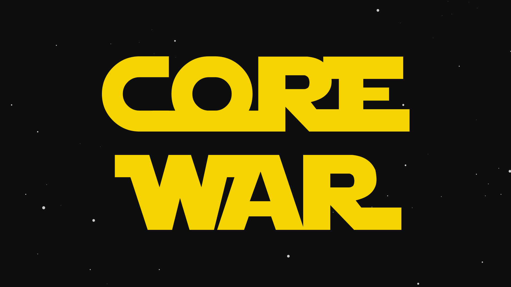

# Corewar

Corewar is a School 42 project. The purpose of this project is an implementation of the programming game **“Core War”**.



Subject: [corewar.en.pdf](/corewar.en.pdf).

Task resources is placed at [the `resources` folder](./resources/).

## Wiki

This project has an 8-page guide. The guide was written **in Russian**.

You can read it [at the Corewar Cookbook](./COREWAR_COOKBOOK.md).

## Project Structure

This project consists of five parts:

* Champion
* Assembler
* Virtual Machine

## How to clone?

This repository includes submodule. So if you want to clone it, you can use the following command:

```
git clone --recurse-submodules <repository url>
```

## Installation

Clone repository and then go into the created directory and run the following command:

```
make
```

## Usage

### `asm`

```
Usage: ./asm (champion.s|champion.cor)
    champion.s   — from assemble to bytecode
    champion.cor — from bytecode to assemble
```

### `corewar`

```
Usage: ./corewar [-a (-dump|-d) <num> (-shed|-s) <num> -l <num>] [-v] [-n <num>] <champion.cor> <...>
    -a          : Print output from "aff" (Default is off)
    -dump <num> : Dump memory (32 octets per line) after <num> cycles and exit
    -d    <num> : Dump memory (64 octets per line) after <num> cycles and exit
    -show <num> : Run <num> cycles, dump memory (32` octets per line), pause and repeat
    -s    <num> : Run <num> cycles, dump memory (64 octets per line), pause and repeat
    -l    <num> : Log levels
                   1  : Show lives
                   2  : Show cycles
                   4  : Show operations
                   8  : Show deaths
                   16 : Show PC movements
    -v          : Run visualizer
    -n    <num> : Set <num> of the next player
```
